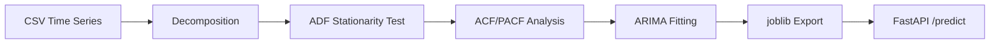

# Time Series Forecasting: ARIMA, SARIMA, Stationarity

## Overview

Time series analysis and forecasting using ARIMA — covering stationarity testing, seasonal decomposition, ACF/PACF analysis, and multi-step forecasting. Two datasets: datacenter power demand (17,520 hourly, AIC=184,514) and silicon aging Vth shift (1,095 daily, AIC=1,772).

| Concept | Description |
|---|---|
| **Stationarity** | A time series whose statistical properties do not change over time |
| **ADF Test** | Augmented Dickey-Fuller test for stationarity (p < 0.05 = stationary) |
| **Differencing** | Removing trend by subtracting consecutive values (d parameter) |
| **ACF/PACF** | Autocorrelation and Partial Autocorrelation — used to choose p and q |
| **ARIMA(p,d,q)** | AutoRegressive Integrated Moving Average model |

## Datasets

| Dataset | Rows | Frequency | Target | Domain |
|---|---|---|---|---|
| Datacenter Power Demand | 17,520 | Hourly | power_kw | Cloud Infrastructure |
| Silicon Aging Vth Shift | 1,095 | Daily | vth_shift_mv | Semiconductor Reliability |

## Results

| Model | Dataset | AIC |
|---|---|---|
| ARIMA(5,1,0) | Datacenter Power | **184,514** |
| ARIMA(5,1,0) | Silicon Aging | **1,772** |

## Quick Start

```bash
git clone https://github.com/AIML-Engineering-Lab/009_time_series_forecasting.git
cd 009_time_series_forecasting
pip install -r requirements.txt
python src/train.py          # Train both ARIMA models
python src/predict.py        # Run forecasts
python tests/test_model.py   # Run tests
uvicorn src.api:app          # Launch API
jupyter notebook notebooks/  # Explore notebooks
```

## Project Structure

```
009_time_series_forecasting/
├── assets/
│   ├── proj1_datacenter_3d_acf_landscape.png
│   ├── proj1_datacenter_3d_decomposition.png
│   ├── proj1_datacenter_3d_phase_space.png
│   ├── proj1_datacenter_acf_pacf.png
│   ├── proj1_datacenter_acf_pacf_analysis.png
│   ├── proj1_datacenter_arima_forecast.png
│   ├── proj1_datacenter_arima_forecast_comparison.png
│   ├── proj1_datacenter_decomposition.png
│   ├── proj1_datacenter_flowchart.png
│   ├── proj1_datacenter_forecast_horizons.png
│   ├── proj1_datacenter_model_heatmap.png
│   ├── proj1_datacenter_seasonal_decomposition.png
│   ├── proj1_datacenter_stationarity.png
│   ├── proj1_datacenter_ts_overview.png
│   ├── proj2_silicon_aging_acf_pacf.png
│   ├── proj2_silicon_aging_arima_forecast.png
│   ├── proj2_silicon_aging_flowchart.png
│   └── proj2_silicon_aging_ts_overview.png
├── data/
│   ├── datacenter_power_demand.csv
│   └── silicon_aging_vth.csv
├── deploy/
│   ├── Dockerfile
│   └── docker-compose.yml
├── docs/
│   ├── Time_Series_Forecasting_Report.html
│   └── Time_Series_Forecasting_Report.pdf
├── models/
│   ├── arima_datacenter.pkl
│   └── arima_silicon_aging.pkl
├── notebooks/
│   ├── 01_timeseries_datacenter.ipynb
│   └── 02_timeseries_silicon_aging.ipynb
├── src/
│   ├── api.py
│   ├── predict.py
│   └── train.py
├── tests/
│   └── test_model.py
├── .gitignore
├── LICENSE
├── README.md
└── requirements.txt
```

## Architecture



## License

MIT
